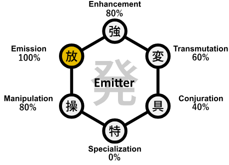
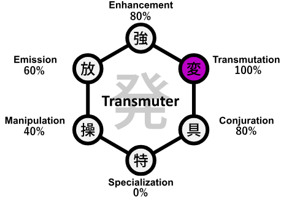

[[Ideal Power System For the Real World]]

**Nen Type (Double):** [[Emission|Emitter]] & [[Transmutation|Transmuter]]

  
  

So 100% on Emission, 90% on Enhancement, 100% on Transmutation, 80% on Manipulation, and 80% on Conjuration.

**Nen Ability:** 
* Dismantle ([[Emission]] + [[Transmutation]])
* Divine Flames ([[Transmutation]] + [[Emission]] + [[Conjuration]])

**Handsign:** Enmaten
**Chant:** Scales of the Dragon. Recoil. Paired falling stars. (name of attack)
## Dismantle
The ability to cut things (flying slashes).
### Progression for Dismantle
1. Learn to shape and fire the Nen in arcs/slash motions. These should be EXTREMELY thin. Use pointing/tracing the slash in order to make this easier but slowly work off from doing so as mastery increases.
2. Use Transmutation to give it a property of “cutting” rather than sharpening the aura. This allows for more versatility. The greater the quantity of Nen infused in a slash leads to greater cutting potency. Due to being the concept of “cutting”, with sufficient power it is able to cut even things that are ethereal, intangible, conceptual, etc. (things like water, air, intangibles like lifespan, or thought, and concepts like space, or distance). The difficulty in cutting is in the following order (least to most):
	1. Solids
	2. Intangibles (like water, gas, or light)
	3. Ethereals (spirits, thought, boundaries, phasing abilities. Physical Forces i.e. gravity.)
	4. Concepts (Space, Time, Lifespan, Death, Heat, Strength, Distance, etc)
3. Add Conditions to increase the power, including a chant, handsign, and pointing/tracing the slash (once pointing/tracing is not necessary to fire it) in order to increase the power. These Conditions are not mandatory, but function more like an enhancement since doing those actions increases the strength in exchange for alerting the enemy to timing and direction of slashes. So each additional action will increase the power from the baseline in the (increasing) order:
	1. Pointing the palm in the direction of the slash
	2. Tracing the slash
	3. Chanting before releasing the slash
	4. Making a handsign before releasing the slash
   Note that (a) and (b) are mutually exclusive. One cannot point their palm and trace it.
4. Build speed skill until the slashes travel and release times sufficiently fast. About 50 m/s, and release time is about 1 second.
5. A Binding Vow is made such that in exchange for sacrificing all Manipulation abilities and potential, the user gets a 10x multiplier on the travel speed of the slash. So while controlling the direction and trajectory of slashes after release will be impossible (meaning the direction a slash is traveling in cannot be changed after it is fired) it will reach the target much, much faster.
6. Master control to the point where multiple slashes can be released simultaneously.
7. A Binding Vow is made such that in exchange for giving up the ability to use multiple slashes at the same time (limiting to one slash being able to release at one time), the activation time required to make a slash is decreased to being near instantaneous. (As a side effect this will make the Conditions like chant, handsign, and pointing/tracing the slash even more potent because not only do they alert the enemy to the direction/timing now, they also cause the activation time to increase.)
8. Learn and master In to hide and conceal aura, so the slashes become invisible and difficult to see. Master this ability until it is even difficult to detect with Gyo.
9. Use a Condition to connect the power of In to the % of total Nen in a slash. Thus the smaller % of Nen (of the total Nen pool) used in a slash, the more concealed it is. This directly contradicts the “Greater quantity of Nen infused in a slash leads to greater cutting potency”, which allows for the Condition to work.
10. Increase mastery, total Nen capacity, and combat ability in order to best Master this ability.

### Special Moves

**Cleave:** The ability to split (bisect) an opponent in a single touch.
1. A Binding Vow is made such that in exchange for cutting the range to zero and having to touch the opponent to activate it, the Nen transmuted with the property of “cutting” is directly passed to the opponent.
2. A second Binding Vow is such that in exchange for drawing that aura out involuntarily, thus instantly consuming it, the calculation for exact amount of aura required to cut them in two from the area touched in any bisection to slice through the opponent in one blow is done automatically. (this means if the user tries to Cleave something above their Nen capacity, their Nen will be completely drawn out and hit 0.)
3. A third Binding Vow is such that in order to make this move possible in the first place, it restricts its usage only to living things.

**Sever:** The ability to sever and split apart nonliving objects and things.
1. A Binding Vow is made such that in exchange for cutting the range to zero and having to touch the opponent to activate it, the Nen transmuted with the property of “cutting” is directly passed to the target.
2. A second Binding Vow is made such that in exchange for restricting its usage to only to nonliving things, several lines of severing can be directed in any STRAIGHT direction (no curves) originating from the point of contact. The aura usage also has to be done manually, unlike Cleave.

**Spiderweb:** A line of Nen placed in any area with the property for cutting, releases on contact. (Trap)
1. A Binding Vow is made such that in exchange for the power of however much Nen is imbued into this line of Nen is decreased, the Nen persists for that much longer than the user’s base ability to maintain it. (i.e. if the Nen is reduced to half of its power, it becomes able to persist twice as long. If it’s reduced to 1/10 of its power, it lasts 10x longer, and so on.)
2. A second Binding Vow is made such that in exchange for being completely unable to manually decide its release time, instantly releases it on any target that ends up running into/touching it. (this binding vow later becomes irrelevant as the Manipulator ability is completely given up, thus it becomes the default anyways).
3. A third Binding Vow is made such that in exchange reducing the range of the slash to only the object/person that touches it rather than released (flying outwards), the In function of the Nen is increased by 50%.

**Benevolent Shrine:** An area of *[[Fū]]* in which the boundary at the end of *[[Fū]]* is made with a rule in which infinite slashes cut apart anything that crosses that boundary.
1. Master *[[Fū]]* to the extent of a minimum of 100m.
2. A Binding Vow is made such that in exchange for this ability being possible, this ability is only usable for as long as the maximum radius is at most 100m.
3. Add a Condition where in order to activate this ability the Enmaten handsign must be made. (It does not have to be maintained)
4. A second Binding Vow is made such that in exchange for the ability to be possible, while Benevolent Shrine is being used, no other Nen abilities (other than the basic, intermediate, and advanced techniques) can be used.
5. A third Binding Vow is made such that in exchange for the ability to be possible, it cannot target living things with Nen (though it can target Nen itself).
6. A fourth Binding Vow is made such that in exchange for losing all sensory ability within *[[Fū]]*, anything that is crossing the boundary is instantly targeted by the aura inside of *[[Fū]]* But only while crossing. Things inside the boundary are not targeted. Only the Aura at the boundary is used for targeting.
7. Learn to control the aura gradient within *[[Fū]]*. Concentrate the aura towards the boundary so that maximum aura is used for targeting.
8. Add a Condition where anything that crosses the boundary of *[[Fū]]* is targeted with a Dismantle. The amount of Nen in each dismantle is decided by the user before the activation of the ability, and stays constant for the duration of its activation. This only applies to while things are crossing, not what’s inside the boundary.

## Divine Flames
Flames that burn energy itself as fuel
### Progression for Divine Flames
1. Learn to transmute Nen into flames, and learn to emit those flames away from the body. Actually learn to make the flames more and more real till it borders on [[Conjuration]].
2. Increase the heat and burning ability as much as possible.
3. Learn to transmute the flames to give them the property of consuming energy. Devouring. Add a condition to make this possible. The condition is that the slashing ability MUST be used on it first. The amount fo consumption is proportional to the amount of damage on the material. Things that are entirely cut “off” from the main “body” of the target can be consumed 100%. Also add a condition that restricts the flames ability to set things on fire. So it only works on stuff you have slashed.
4. Add Conditions to increase the power, including a chant, handsign, and pointing (once pointing is not necessary to fire it) in order to increase the power. These Conditions are not mandatory, but function more like an enhancement since doing those actions increases the strength in exchange for alerting the enemy to timing and direction of slashes. So each additional action will increase the power from the baseline in the (increasing) order:
   1. Pointing the palm in the direction of the flames
   2. Drawing back special movements (like drawing an arrow)
   3. Chanting before releasing the flames
   4. Making a handsign before releasing the flames
   5. Note that (a) and (b) are mutually exclusive. One cannot point their palm and do unique hand movements.
5. Build speed skill until the slashes travel and release times sufficiently fast. About 50 m/s, and release time is about 1 second.
6. A Binding Vow is made such that in exchange for sacrificing all Manipulation abilities and potential, the user gets a 10x multiplier on the travel power of the flames. So while controlling the direction and trajectory of flames after release (shooting/firing them) will be impossible (meaning the control of the flames after firing in a certain direction cannot be changed) it will reach the target much faster, and be far more powerful.
7. Increase mastery, total Nen capacity, and Nen efficiency in order to best Master this ability.

### Special Moves

**Flame Arrow:** The ability to fire the flames as an arrow in a specific direction.
1. A Binding Vow is made such that in exchange for restricting the shape and control of the flames after release, the speed and power of the flames is increased.
2. A second Binding is made such that the longer the arrow is drawn, the more difficult it is to draw (more physical strength it requires). In exchange the longer the arrow is drawn, the more powerful and faster the flames are after release.

### Ultimate culmination of the technique

**Malevolent Shrine:** An area of *[[Fū]]* in which the boundary at the end of *[[Fū]]* is made with a rule in which infinite slashes cut apart anything inside it other than the person using it.
1. Master *[[Fū]]* to the extent of a minimum of 100m.
2. A Binding Vow is made such that in exchange for this ability being possible, this ability is only usable for as long as the minimum radius of 100m is maintained.
3. A second Binding Vow is made such that in exchange for this ability to be possible, this ability can only be activated and maintained for as long as the Enmaten handsign is maintained.
4. A third Binding Vow is made such that in exchange for the ability to be possible, while Malevolent Shrine is being used, no other Nen abilities (other than the basic, intermediate, and advanced techniques) can be used.
5. A fourth Binding Vow is made such that in exchange for the ability to be possible, after the use of Malevolent Shrine, for a time equal to how long Malevolent Shrine was maintained, the user cannot use their Nen ability.
6. A fifth Binding Vow is made such that in exchange for losing all sensory ability within *[[Fū]]*, everything living and nonliving can be directly targeted without that information flowing to the user.
7. Add a Condition where anything on the inside the Boundary of *[[Fū]]* is targeted by the aura filling the inside of *[[Fū]]*.
8. Add a Condition where anything inside of *[[Fū]]* is targeted with a Dismantle. The amount of Nen in each dismantle is decided by the user before the activation of the ability, and stays constant for the duration of its activation.
9. A sixth Binding Vow is made such that in exchange for the slashes becoming completely visible, the slashes directly form from the aura directly on the edges of objects/boundaries/Nen since the Nen of the user does not permeate them.
10. When using divine flames during Malevolent Shrine, the flames can only be used after precisely 99 seconds of Malevolent Shrine. The flames use the debris and dust created by the infinite slashes as the perfect fuel. The more the “fuel” is reduced to dust, the better “fuel” it makes. Thus it is used to burn everything inside in a massive debris fueled explosion of fire.
